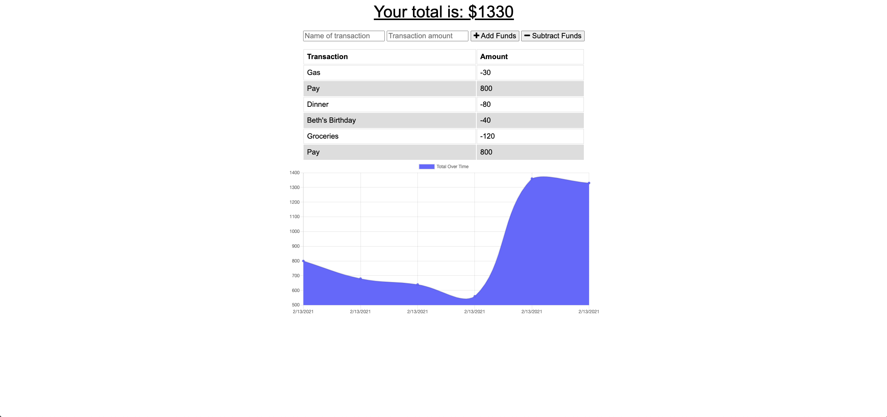

# Budget-Tracker

## This app is deployed on Heroku. https://budget-tracker-ads.herokuapp.com/

### Collaborated with https://github.com/ReindeerCode

## License

## Project Description

This application allows the user to enter deposits and expenditures to keep track of their budget.
While offline, the user input is stored in the indexed DB and then pushed to the database when they go back online.

## Acceptance Criteria

If a user is on the Budget Tracker App without internet connection and enters deposits or withdrawal it will be shown on the page and added to the transaction history once they go back online.

## Github Username

https://github.com/arensalmela

## Github Repository

https://github.com/arensalmela/Budget-Tracker

## Screenshot

